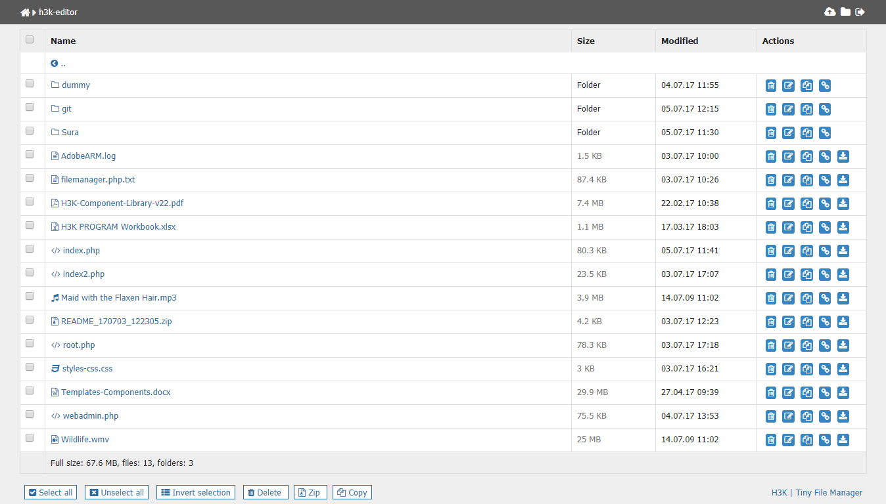

# Tiny PHP File Manager
Tiny file manager in single php file

<h3>How to use</h3>

Download ZIP with latest version from master branch.

Copy tinyfilemanager.php to your website folder and open it with web browser (e.g. http://yoursite/any_path/tinyfilemanager.php).

Default username/password: admin/admin. password has encripted with MD5.

Warning: Please set your own username and password in $auth_users before use.

To enable/disable authentication set $use_auth to true or false.

<h3>Features</h3>
<ul>
<li>Open Source, light and extremely simple</li>
<li>Basic features likes Create, Delete, Modify, View, Download, Copy and Move files </li>
<li>Ability to upload multiple files</li>
<li>Ability to create folders and files</li>
<li>Ability to compress, extract files</li>
<li>Support user permissions - based on session</li>
<li>Copy direct file URL</li>
<li>Edit text file formats using advanced editor with syntax highlight</li>
<li>lots more...</li>
</ul>

Source: <a target="_balnk" href="https://github.com/alexantr/filemanager">filemanager</a>(original version) were built by <a href="https://github.com/alexantr" target="_balnk">alexantr</a>. 
This is an excellent and improved version of the original.
