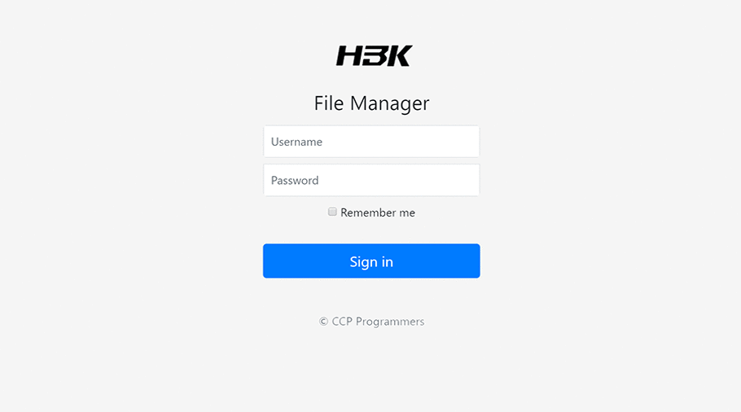

# Tiny File Manager

[](https://tinyfilemanager.github.io/demo/)
[](https://github.com/prasathmani/tinyfilemanager/wiki)
[](https://github.com/prasathmani/tinyfilemanager/releases)
[](https://github.com/prasathmani/tinyfilemanager/blob/master/LICENSE)
[](https://www.paypal.me/prasathmani)


> TinyFileManager is web based PHP file manager and it is a simple, fast and small size in single-file PHP file that can be dropped into any folder on your server, multi-language ready web application for storing, uploading, editing and managing files and folders online via web browser. The Application runs on PHP 5.5+, It allows the creation of multiple users and each user can have its own directory and a build-in support for managing text files with cloud9 IDE and it supports syntax highlighting for over 150+ languages and over 35+ themes.

## Demo

[Demo](https://tinyfilemanager.github.io/demo/)


## Documentation

Tinyfilemanager is highly documented on the [wiki pages](https://github.com/prasathmani/tinyfilemanager/wiki).

[](screenshot.gif)

## Requirements

- PHP 5.5.0 or higher.
- Fileinfo, iconv, zip, tar and mbstring extensions are strongly recommended.

## How to use

Download ZIP with latest version from master branch.

Just copy the tinyfilemanager.php to your webspace - thats all :)
You can also change the file name from "tinyfilemanager.php" to something else, you know what i meant for.

Default username/password: **admin/admin@123** and **user/12345**.

:warning: Warning: Please set your own username and password in `$auth_users` before use. password is encrypted with <code>password_hash()</code>. to generate new password hash [here](https://tinyfilemanager.github.io/docs/pwd.html)

To enable/disable authentication set `$use_auth` to true or false.

:information_source: Add your own configuration file [config.php](https://tinyfilemanager.github.io/config-sample.txt) in the same folder to use as additional configuration file.

:information_source: To work offline without CDN resources, use [offline](https://github.com/prasathmani/tinyfilemanager/tree/offline) branch

### :loudspeaker: Features

- :cd: Open Source, light and extremely simple
- :iphone: Mobile friendly view for touch devices
- :information_source: Basic features likes Create, Delete, Modify, View, Download, Copy and Move files
- :arrow_double_up: Ajax Upload, Ability to drag & drop, upload from URL, multiple files upload with file extensions filter
- :file_folder: Ability to create folders and files
- :gift: Ability to compress, extract files (`zip`, `tar`)
- :sunglasses: Support user permissions - based on session and each user root folder mapping
- :floppy_disk: Copy direct file URL
- :pencil2: Cloud9 IDE - Syntax highlighting for over `150+` languages, Over `35+` themes with your favorite programming style
- :page_facing_up: Google/Microsoft doc viewer helps you preview `PDF/DOC/XLS/PPT/etc`. 25 MB can be previewed with the Google Drive viewer
- :zap: Backup files and IP blacklist and whitelist
- :mag_right: Search - Search and filter files using `datatable js`
- :file_folder: Exclude folders and files from listing
- :globe_with_meridians: Multi-language(32+) support and for translations `translation.json` is file required
- :bangbang: lots more...

## Deploy by Docker

Make sure you have **already installed docker**, [Install reference](https://docs.docker.com/engine/install/)

> **Notice:** Your need an absolute path, and it will be served by tinyfilemanager.
> 
> If you want to serve this project at **raspberry pi or another special platform**, you can download project and **build image by yourself**.

You can execute this following commands:

```shell
$ docker run -d -v /absolute/path:/var/www/html/data -p 80:80 --restart=always --name tinyfilemanager tinyfilemanager/tinyfilemanager:master
$ docker ps
CONTAINER ID   IMAGE                                COMMAND                  CREATED         STATUS         PORTS                                       NAMES
648dfba9c0ff   tinyfilemanager/tinyfilemanager:master   "docker-php-entrypoi…"   4 minutes ago   Up 4 minutes   0.0.0.0:80->80/tcp, :::80->80/tcp           tinyfilemanager
```
Access `http://127.0.0.1/` and enter default username and password, then enjoy it.

DockerHub: [https://hub.docker.com/r/tinyfilemanager/tinyfilemanager](https://hub.docker.com/r/tinyfilemanager/tinyfilemanager)

#### How to change config within docker

Origin:

```php
// Root path for file manager
// use absolute path of directory i.e: '/var/www/folder' or $_SERVER['DOCUMENT_ROOT'].'/folder'
$root_path = $_SERVER['DOCUMENT_ROOT'];

// Root url for links in file manager.Relative to $http_host. Variants: '', 'path/to/subfolder'
// Will not working if $root_path will be outside of server document root
$root_url = '';
```

Modified:

```php
// Root path for file manager
// use absolute path of directory i.e: '/var/www/folder' or $_SERVER['DOCUMENT_ROOT'].'/folder'
$root_path = $_SERVER['DOCUMENT_ROOT'].'/data';

// Root url for links in file manager.Relative to $http_host. Variants: '', 'path/to/subfolder'
// Will not working if $root_path will be outside of server document root
$root_url = 'data/';
```

Then, change another config what you want, and add a new volume `-v /absolute/path/index.php:/var/www/html/index.php` in `docker run` command, like this:

```shell
$ docker run -d -v /absolute/path:/var/www/html/data -v /absolute/path/index.php:/var/www/html/index.php -p 80:80 --restart=always --name tinyfilemanager tinyfilemanager/tinyfilemanager:master
```

#### Stop running

If you want to stop a running docker service, or you want to restart a service, you should stop it first, or you got `docker: Error response from daemon: Conflict. The container name "/tinyfilemanager" is already in use by container ...` problem. You can execute this command:

```shell
$ docker rm -f tinyfilemanager
```

### <a name=license></a>License, Credit

- Available under the [GNU license](https://github.com/prasathmani/tinyfilemanager/blob/master/LICENSE)
- Original concept and development by github.com/alexantr/filemanager
- CDN Used - _jQuery, Bootstrap, Font Awesome, Highlight js, ace js, DropZone js, and DataTable js_
- To report a bug or request a feature, please file an [issue](https://github.com/prasathmani/tinyfilemanager/issues)
- [Contributors](https://github.com/prasathmani/tinyfilemanager/wiki/Authors-and-Contributors)
