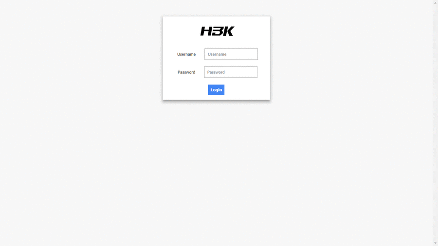

# Tiny File Manager

[](https://tinyfilemanager.github.io/demo/)
[](https://github.com/prasathmani/tinyfilemanager/wiki)
[](https://github.com/prasathmani/tinyfilemanager/releases)
[](https://github.com/prasathmani/tinyfilemanager/blob/master/LICENSE)
[](https://www.paypal.me/prasathmani)


> TinyFileManager is a versatile web-based PHP file manager designed for simplicity and efficiency. This lightweight single-file PHP application can be effortlessly integrated into any server directory, allowing users to store, upload, edit, and manage files and folders directly through their web browser.
With multi-language support and compatibility with PHP 5.5+, TinyFileManager enables the creation of individual user accounts, each with its dedicated directory. The platform also includes built-in functionality for handling text files using the Cloud9 IDE.
Featuring syntax highlighting for over 150 languages and more than 35 themes, TinyFileManager offers a comprehensive solution for file management in an online environment.

<sub>**Caution!** _Avoid utilizing this script as a standard file manager in public spaces. It is imperative to remove this script from the server after completing any tasks._</sub>

## Demo

[Demo](https://tinyfilemanager.github.io/demo/)


## Documentation

Tinyfilemanager is highly documented on the [wiki pages](https://github.com/prasathmani/tinyfilemanager/wiki).

[](screenshot.gif)

## Requirements

- PHP 5.5.0 or higher.
- Fileinfo, iconv, zip, tar and mbstring extensions are strongly recommended.

## How to use

Download ZIP with latest version from master branch.

Just copy the tinyfilemanager.php to your webspace - thats all :)
You can also change the file name from "tinyfilemanager.php" to something else, you know what i meant for.

Default username/password: **admin/admin@123** and **user/12345**.

:warning: Warning: Please set your own username and password in `$auth_users` before use. password is encrypted with <code>password_hash()</code>. to generate new password hash [here](https://tinyfilemanager.github.io/docs/pwd.html)

To enable/disable authentication set `$use_auth` to true or false.

:information_source: Add your own configuration file [config.php](https://tinyfilemanager.github.io/config-sample.txt) in the same folder to use as additional configuration file.

:information_source: To work offline without CDN resources, use [offline](https://github.com/prasathmani/tinyfilemanager/tree/offline) branch

### :loudspeaker: Features

- :cd: **Open Source:** Lightweight, minimalist, and extremely simple to set up.
- :iphone: **Mobile Friendly:** Optimized for touch devices and mobile viewing.
- :information_source: **Core Features:** Easily create, delete, modify, view, download, copy, and move files.
- :arrow_double_up: **Advanced Upload Options:** Ajax-powered uploads with drag-and-drop support, URL imports, and multi-file uploads with extension filtering.
- :file_folder: **Folder & File Management:** Create and organize folders and files effortlessly.
- :gift: **Compression Tools:** Compress and extract files in `zip` and `tar` formats.
- :sunglasses: **User Permissions:** User-specific root folder mapping and session-based access control.
- :floppy_disk: **Direct URLs:** Easily copy direct URLs for files.
- :pencil2: **Code Editor:** Includes Cloud9 IDE with syntax highlighting for 150+ languages and 35+ themes.
- :page_facing_up: **Document Preview:** Google/Microsoft document viewer for PDF/DOC/XLS/PPT, supporting previews up to 25 MB.
- :zap: **Security Features:** Backup capabilities, IP blacklisting, and whitelisting.
- :mag_right: **Search Functionality:** Use `datatable.js` for fast file search and filtering.
- :file_folder: **Customizable Listings:** Exclude specific folders and files from directory views.
- :globe_with_meridians: **Multi-language Support:** Translations available in 35+ languages with `translation.json`.
- :bangbang: **And Much More!**

### [Deploy by Docker](https://github.com/prasathmani/tinyfilemanager/wiki/Deploy-by-Docker)

---

## Rozšírenie oprávnení a rolí (vlastné úpravy)

Tento fork pridáva systém rolí pre zdieľanie súborov medzi klientmi a dodávateľmi projektu.

### Roly a oprávnenia

| Rola | Upload | Download | Rename / Zip / Copy | Mazať | Vidí |
|---|:---:|:---:|:---:|:---:|---|
| `admin` | ✅ | ✅ | ✅ | ✅ | celý root priečinok |
| `manager` | ✅ | ✅ | ✅ | ❌ | celý root priečinok |
| `client` | ✅ | ✅ | ❌ | ❌ | len svoj priečinok |
| `supplier` | ✅ | ✅ | ❌ | ❌ | len svoj priečinok |

### Konfigurácia

Všetky nastavenia sa nachádzajú v súbore **`config.php`** v rovnakom priečinku ako `tinyfilemanager.php`. Hlavný súbor `tinyfilemanager.php` **neupravujte** – `config.php` jeho hodnoty automaticky prepíše.

```php
// Používatelia a heslá (bcrypt hash)
$auth_users = array(
    'admin'    => '$2y$10$...', // admin@123
    'manager1' => '$2y$10$...', // 12345
    'client1'  => '$2y$10$...', // 12345
    'supplier1'=> '$2y$10$...', // 12345
);

// Roly
$readonly_users     = array();                           // len sťahovanie
$upload_only_users  = array('client1', 'supplier1');     // upload + download
$manager_users      = array('manager1');                 // všetko okrem mazania

// Izolované priečinky (klienti/dodávatelia vidia len svoj)
$directories_users = array(
    'client1'   => '/var/www/html/uploads/client1',
    'supplier1' => '/var/www/html/uploads/supplier1',
);
```

### Pridanie nového používateľa

1. **Vygenerovať hash hesla** (v termináli na serveri):
   ```bash
   php -r "echo password_hash('vase_heslo', PASSWORD_BCRYPT) . PHP_EOL;"
   ```
   Prípadne online: https://tinyfilemanager.github.io/docs/pwd.html

2. **Doplniť do `config.php`:**
   ```php
   // 1. pridať používateľa
   $auth_users['client3'] = '$2y$10$...hash...';

   // 2. priradiť rolu
   $upload_only_users[] = 'client3';

   // 3. nastaviť izolovaný priečinok
   $directories_users['client3'] = '/var/www/html/uploads/client3';
   ```

3. **Vytvoriť priečinok na disku:**
   ```bash
   mkdir /var/www/html/uploads/client3
   ```

### <a name=license></a>License, Credit

- Available under the [GNU license](https://github.com/prasathmani/tinyfilemanager/blob/master/LICENSE)
- Original concept and development by github.com/alexantr/filemanager
- CDN Used - _jQuery, Bootstrap, Font Awesome, Highlight js, ace js, DropZone js, and DataTable js_
- To report a bug or request a feature, please file an [issue](https://github.com/prasathmani/tinyfilemanager/issues)
- [Contributors](https://github.com/prasathmani/tinyfilemanager/wiki/Authors-and-Contributors)
